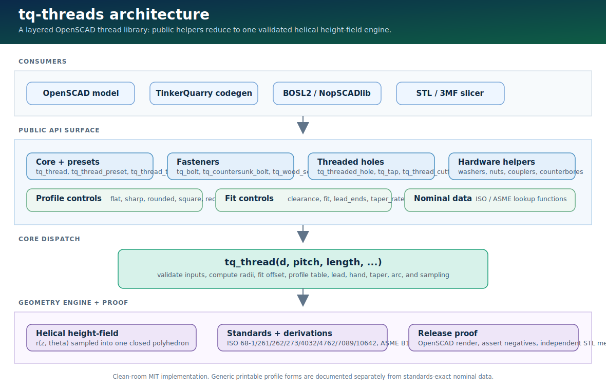

<!-- SPDX-License-Identifier: MIT -->
# tq-threads User Manual

Professional reference for `tq-threads` v0.6.0, a clean-room MIT OpenSCAD
library for printable screw threads, threaded holes, bolts, nuts, washers,
couplers, augers, and related fastener geometry.

This manual is written for people who need to design printable threaded parts,
audit the geometry model, or integrate the library into a generator such as
TinkerQuarry. For source provenance and standards classification, see
[REFERENCES.md](REFERENCES.md) and [PROVENANCE.md](PROVENANCE.md).



## Contents

1. [What tq-threads is](#what-tq-threads-is)
2. [Architecture](#architecture)
3. [Installation](#installation)
4. [Thread model](#thread-model)
5. [Core API: `tq_thread`](#core-api-tq_thread)
6. [Profile control](#profile-control)
7. [Preset and measurement functions](#preset-and-measurement-functions)
8. [Threaded primitives](#threaded-primitives)
9. [Fasteners and screw forms](#fasteners-and-screw-forms)
10. [Holes, washers, couplers, and convenience wrappers](#holes-washers-couplers-and-convenience-wrappers)
11. [Drives, hex helpers, and debug tools](#drives-hex-helpers-and-debug-tools)
12. [Resolution and performance](#resolution-and-performance)
13. [FDM fit and print tuning](#fdm-fit-and-print-tuning)
14. [Integration patterns](#integration-patterns)
15. [Migration guide](#migration-guide)
16. [Testing and release proof](#testing-and-release-proof)
17. [Troubleshooting](#troubleshooting)
18. [Limits and design honesty](#limits-and-design-honesty)

---

## What tq-threads is

`tq-threads` is a single-file OpenSCAD library. At runtime you only need
`tq_threads.scad`. The public API is namespaced with `tq_*` so it can coexist
with BOSL2, NopSCADlib, custom part libraries, and code-generated OpenSCAD.

The library is optimized for printable geometry:

- Threads are generated as one closed `polyhedron`, not as many boolean-unioned
  teeth.
- External and internal threads use the same nominal model plus an explicit
  diametral `clearance` value for FDM fit.
- Named presets cover ISO metric coarse/fine and Unified UNC/UNF sizes.
- Helpers build common printable parts: rods, tapped holes, nuts, bolts,
  countersunk screws, wood-screw-like forms, washers, couplers, standoffs,
  augers, bottle-style coarse threads, and clearance/counterbore/countersink
  cutters.

The library is not a metrology tool. It produces a nominal printable surface,
not ISO/ASME min/max tolerance envelopes. Where a feature is approximate or
generic, this manual says so directly.

---

## Architecture

The public API is intentionally layered. Most helpers reduce to the same core
thread engine, which keeps behavior consistent across rods, bolts, nuts, tapped
holes, and cutters.

### System layers

| Layer | Responsibility | Public examples |
|---|---|---|
| Consumer models | Your OpenSCAD model or generated code calls `tq_*` modules. | `include <tq_threads.scad>` |
| Public API | Stable modules and lookup functions. | `tq_thread`, `tq_bolt`, `tq_nut`, `tq_threaded_hole` |
| Core dispatch | Validates parameters, computes profile height, clearance/fit offset, lead, hand, taper, and profile table. | `tq_thread(...)` |
| Geometry engine | Samples a helical height-field into one watertight polyhedron. | internal `_tq_thread_solid` |
| Standards data | Nominal pitch/diameter/head/washer/clearance values and derived formulas. | `TQ_PRESETS`, `tq_clearance_dia`, `tq_shcs_head` |
| Proof harness | Renders known cases, rejects invalid calls, and independently checks STL manifoldness. | `scripts/render_proof.ps1` |

### How a call becomes mesh

1. You call a helper such as `tq_thread_preset("M8", 20)` or
   `tq_threaded_hole(6, 1.0, 12)`.
2. Preset/helper code resolves dimensions and forwards to `tq_thread`.
3. `tq_thread` validates inputs with `assert`, then computes:
   - major/minor radii,
   - clearance and optional ISO 965 position allowance,
   - lead from `starts * pitch`,
   - handedness,
   - profile shape and radial depth,
   - optional lead chamfers, taper, partial arc, and groove inversion.
4. The geometry engine samples radius as a function of Z and angle:

   ```text
   r(z, theta) = profile(frac((z - dir * (theta / 360) * lead) / pitch))
   ```

5. OpenSCAD receives a single closed `polyhedron` with side faces and end caps.
6. Wrappers use ordinary OpenSCAD `difference()` only for part-level operations
   such as cutting a tapped hole or recessing a drive.

This architecture is why the main thread body is robust: the thread itself is
not an N-way boolean union of separate teeth.

### Coordinate conventions

- Thread axis is Z.
- Default base is at `z=0`, length extends toward positive Z.
- `center=true` centers the thread around `z=0`.
- The start end is `z=0`; the far end is `z=length`.
- `hand="right"` is the normal right-hand helix. Use `hand="left"` for
  left-hand threads.

---

## Installation

### Use as a vendored file

Copy `tq_threads.scad` next to your model:

```openscad
include <tq_threads.scad>;
```

### Use as a project dependency

```powershell
git submodule add https://github.com/scottconverse/tq-threads libs/tq-threads
```

Then include it by relative path:

```openscad
include <libs/tq-threads/tq_threads.scad>;
```

### Use through `OPENSCADPATH`

Put the repo directory on the OpenSCAD library path, then:

```openscad
include <tq_threads.scad>;
```

Use `include`, not `use`, when you need functions and constants such as
`tq_preset`, `tq_in`, `TQ_PRESETS`, or `TQ_THREADS_VERSION`.

---

## Thread model

A conventional ISO/Unified V thread is described by a nominal major diameter
`d`, pitch `P`, and a 60-degree included flank angle. The sharp triangle height
is:

```text
H = sqrt(3) / 2 * P = 0.8660254 * P
```

The default `profile="flat"` uses the ISO/UN basic form:

- crest flat: `P/8`
- root flat: `P/4`
- engaged radial depth: `5H/8 = 0.541266 * P`
- nominal minor diameter: `d - 1.082532 * P`

For FDM printing, the most important extra value is `clearance`. It is a total
diametral fit allowance:

- external thread radius shifts inward by `clearance / 2`,
- internal thread/cutter radius shifts outward by `clearance / 2`.

Make mating printed parts with the same `clearance` unless you intentionally
want an asymmetric fit.

---

## Core API: `tq_thread`

`tq_thread` is the one core module. It can render an external thread, an
internal cutter, a partial thread, a multi-start thread, a groove, or a custom
profile.

```openscad
tq_thread(d, pitch, length,
          internal=false,
          starts=1,
          hand="right",
          clearance=0.4,
          fit=undef,
          profile="flat",
          angle=60,
          tooth_height=undef,
          minor_d=undef,
          crest_flat=undef,
          root_flat=undef,
          round=1,
          lead_in=true,
          lead_out=true,
          chamfer=undef,
          taper=0,
          arc=360,
          fn=undef,
          steps_per_pitch=16,
          center=false,
          thread_size=undef,
          side_angle=undef,
          rect_ratio=undef,
          groove=false,
          taper_rate=undef,
          lead_ends=undef);
```

### Required parameters

| Parameter | Meaning |
|---|---|
| `d` | Nominal major diameter in millimeters. |
| `pitch` | Axial distance from one crest to the next, in millimeters. |
| `length` | Threaded length along Z, in millimeters. |

### Fit, handedness, and placement

| Parameter | Default | Meaning |
|---|---:|---|
| `internal` | `false` | `false` renders an external thread. `true` renders an oversized internal cutter. |
| `starts` | `1` | Number of starts. Lead is `starts * pitch`. |
| `hand` | `"right"` | `"right"` or `"left"`. |
| `clearance` | `0.4` | Total diametral FDM fit allowance. |
| `fit` | `undef` | Optional ISO 965 position allowance such as `"6g"` or `"6H"`. Grade width is not modeled. |
| `center` | `false` | Center on Z instead of starting at `z=0`. |

### Profile shape

| Parameter | Default | Meaning |
|---|---:|---|
| `profile` | `"flat"` | `"flat"`, `"sharp"`, `"rounded"`, `"square"`, `"rectangle"`, or `"rect"`. |
| `angle` | `60` | Included flank angle, used unless `side_angle` is supplied. |
| `side_angle` | `undef` | Half-angle measured from the plane perpendicular to the axis. `30` means a normal 60-degree V. |
| `thread_size` | `pitch` | Axial width of one tooth/groove. Must be `<= pitch`. |
| `rect_ratio` | context | Depth ratio for rectangular profile. Defaults to `1` for square and `1/3` for rectangle. |
| `tooth_height` | `undef` | Direct radial depth override. |
| `minor_d` | `undef` | Direct minor/core diameter override. |
| `crest_flat` | context | Crest flat width. Defaults to `thread_size/8` except sharp uses `0`. |
| `root_flat` | context | Root flat width. Defaults to `thread_size/4` except sharp uses `0`. |
| `round` | `1` | Fillet scale for `profile="rounded"`. |
| `groove` | `false` | Invert the selected profile into a helical channel. |

### Ends, taper, and mesh controls

| Parameter | Default | Meaning |
|---|---:|---|
| `lead_in` | `true` | Taper the start end. |
| `lead_out` | `true` | Taper the far end. |
| `lead_ends` | `undef` | `"none"`, `"start"`, `"end"`, or `"both"`. Overrides `lead_in`/`lead_out`. |
| `chamfer` | thread height | Axial length of lead taper. |
| `taper` | `0` | Total diameter reduction over the length. |
| `taper_rate` | `undef` | Diameter reduction per axial millimeter. Added to `taper`. |
| `arc` | `360` | Angular sweep. Use less than 360 for partial-arc threads. |
| `fn` | `undef` | Per-call angular segment override. |
| `steps_per_pitch` | `16` | Axial sampling density. |

### Examples

```openscad
// M8 x 1.25 external rod, 20 mm long
tq_thread(8, 1.25, 20);

// Two-start left-hand thread
tq_thread(8, 1.25, 20, starts=2, hand="left");

// Cutter for a tapped hole
difference() {
    cube([20,20,12], center=true);
    translate([0,0,-6]) tq_thread(6, 1.0, 14, internal=true);
}

// Rounded printable root
tq_thread(10, 1.5, 20, profile="rounded");

// Partial arc for a split clamp
tq_thread(20, 2, 12, arc=210);
```

### Validation

Bad inputs fail with OpenSCAD `assert` messages before generating malformed
geometry. Common validations include:

- positive `d`, `pitch`, `length`, and `steps_per_pitch`;
- `arc` in `(0, 360]`;
- `starts` integer and at least 1;
- valid `hand`, `profile`, and `lead_ends`;
- non-negative `clearance`, `chamfer`, `taper`, and `taper_rate`;
- `thread_size <= pitch`;
- positive `rect_ratio`;
- valid internal/external `fit` case;
- enough core radius left after depth, rounded root, and taper.

---

## Profile control

The default is the standards-based flat V form. v0.6.0 adds generic printable
profile controls for nonstandard but useful FDM shapes.

### Profile quick reference

| Goal | Parameters | Notes |
|---|---|---|
| ISO/UN basic V | `profile="flat"` | Default. Standards-derived nominal geometry. |
| Full pointed V | `profile="sharp"` | Apex reaches major diameter. Not usually best for FDM strength. |
| Rounded root/crest | `profile="rounded"` | Useful for stronger printed roots. |
| Square tooth | `profile="square", thread_size=w` | Generic printable square form. Depth equals `thread_size`. |
| Rectangular tooth | `profile="rectangle", thread_size=w, rect_ratio=r` | Depth is `w * r`. |
| Narrow V on coarse helix | `thread_size < pitch, side_angle=30, profile="sharp"` | Pitch controls travel; `thread_size` controls tooth width. |
| Helical groove | `groove=true` | Inverts the selected profile into the cylinder surface. |
| Rate-based taper | `taper_rate=tq_npt_taper_rate()` | 1:16 diameter taper reference only. Not a full NPT profile. |

### Side-angle convention

`angle` is an included angle. `side_angle` is measured from the plane
perpendicular to the axis. These are equivalent for symmetric V profiles:

```text
side_angle = angle / 2
side_angle=30 => included angle 60
```

The radial height for a sharp V of axial tooth width `S` is:

```text
h = S / (2 * tan(side_angle))
```

### Groove mode

`groove=true` does not subtract a separate swept cutter. It inverts the same
height-field profile into the cylinder surface, so the result remains one direct
polyhedron.

```openscad
// A helical channel around a 14 mm cylinder
tq_thread(14, 4, 20,
          profile="square",
          thread_size=1.2,
          groove=true,
          lead_ends="both");
```

### Square and rectangular forms

Square and rectangular profiles are generic printable forms. They are not
standards-accurate ACME, trapezoidal, buttress, or pipe-thread profiles.

```openscad
// Square tooth
tq_thread(12, 3, 20, profile="square", thread_size=1.5);

// Shallow rectangular tooth
tq_thread(12, 6, 20, profile="rectangle", thread_size=4, rect_ratio=1/3);
```

---

## Preset and measurement functions

### Presets

```openscad
tq_preset(name);             // -> [major_mm, pitch_mm] or undef
tq_preset_count();           // -> 101
tq_presets_selfcheck();      // -> true if every row resolves correctly
tq_thread_preset(name, length, ...);
tq_thread_tpi(d, tpi, length, ...);
tq_in(inches);               // inch to mm
tq_npt_taper_rate();         // -> 1/16
```

`tq_thread_preset` and `tq_thread_tpi` forward the full v0.6 profile-control
surface to `tq_thread`, including `fit`, `angle`, `minor_d`, `thread_size`,
`side_angle`, `rect_ratio`, `groove`, `taper_rate`, and `lead_ends`.

```openscad
tq_thread_preset("M8", 20);
tq_thread_preset("M8x1", 20, clearance=0.3);
tq_thread_preset("1/4-20", 12);
tq_thread_tpi(d=tq_in(1/4), tpi=20, length=tq_in(1/2));
tq_thread_preset("M8", 20, profile="square", thread_size=1);
```

### Hardware lookup functions

| Function | Returns | Source |
|---|---|---|
| `tq_clearance_dia(size, fit="medium")` | Clearance hole diameter | ISO 273 |
| `tq_washer_dims(size)` | `[inner_d, outer_d, thickness]` | ISO 7089 |
| `tq_nut_thickness(size)` | Hex nut height | ISO 4032 |
| `tq_nut_across_flats(size)` | Hex nut width across flats | ISO 4032 |
| `tq_shcs_head(size)` | `[head_diameter, head_height]` | ISO 4762 |
| `tq_hex_key_af(size)` | Hex-key across flats | ISO 4762 |
| `tq_csk_head_dia(size)` | Countersunk head diameter | ISO 10642 |
| `tq_hex_across_corners(af)` | Hex across-corners width from across-flats | Geometry |
| `tq_hex_across_flats(ac)` | Hex across-flats width from across-corners | Geometry |
| `tq_ph_dims(size)` | Approximate printable Phillips dimensions | Generic |
| `tq_ph_size_for(d)` | Suggested Phillips size for screw diameter | Generic |

Unknown hardware sizes use documented ratio fallbacks so custom dimensions still
render, but listed ISO sizes should be preferred when you need nominal hardware
compatibility.

---

## Threaded primitives

### Rods, cutters, and holes

```openscad
tq_threaded_rod(d, pitch, length,
                starts=1, hand="right", clearance=0.4,
                profile="flat", fn=undef, center=false);

tq_thread_cutter(d, pitch, length,
                 starts=1, hand="right", clearance=0.4,
                 profile="flat", fn=undef,
                 through=true, center=false);

tq_threaded_hole(d, pitch, depth,
                 starts=1, hand="right", clearance=0.4,
                 profile="flat", fn=undef, through=true);
```

Use cutters and holes inside `difference()`:

```openscad
difference() {
    translate([-10,-10,0]) cube([20,20,12]);
    tq_threaded_hole(6, 1.0, 12);
}
```

`through=true` overshoots by 0.5 mm on each end for clean boolean cuts.
For blind holes, use `through=false` and make sure your model leaves enough
depth for the lead-in and printed clearance.

### Nuts and standoffs

```openscad
tq_nut(d, pitch,
       height=undef, across_flats=undef,
       starts=1, hand="right", clearance=0.4,
       profile="flat", chamfer=true, fn=undef);

tq_standoff(d, pitch, length,
            od=undef, starts=1, hand="right",
            clearance=0.4, profile="flat", fn=undef);
```

`tq_nut` defaults to ISO 4032 thickness and across-flats values when known.
`tq_standoff` creates a cylindrical boss with a threaded bore.

```openscad
tq_nut(8, 1.25);
tq_standoff(5, 0.8, 14, od=9);
```

---

## Fasteners and screw forms

### Machine bolts

```openscad
tq_bolt(d, pitch, length,
        head="socket", head_d=undef, head_h=undef,
        shank=0, drive="hex", hand="right",
        clearance=0.4, profile="flat", fn=undef);
```

Head choices:

- `"socket"`: cylindrical socket head, default ISO 4762 dimensions.
- `"hex"`: external hex head, using ISO 4032 across-flats as the default size.
- `"plain"`: plain cylindrical head.
- `"none"`: no head; useful when you need a custom head shape.

`drive` selects the recess on socket/plain heads:

- `"hex"`: hex socket;
- `"phillips"`: printable cruciform approximation;
- `"none"`: no recess.

```openscad
tq_bolt(8, 1.25, 20, head="socket", shank=4);
tq_bolt(6, 1.0, 16, head="hex");
tq_bolt(5, 0.8, 12, drive="phillips");
```

### Countersunk screws

```openscad
tq_countersunk_bolt(d, pitch, length,
                    head_d=undef, head_angle=90,
                    shank=0, drive="hex", hand="right",
                    clearance=0.4, profile="flat", fn=undef);
```

The default head diameter follows ISO 10642 for known metric sizes. The head is
a cone whose bearing face is below `z=0`, narrowing to the thread/shank at
`z=0`.

```openscad
tq_countersunk_bolt(5, 0.8, 16);
tq_countersunk_bolt(6, 1.0, 18, drive="phillips");
```

### Generic wood/self-tapping screw

```openscad
tq_wood_screw(d, length,
              pitch=undef, head="countersunk", head_d=undef,
              point="gimlet", taper=0, core_d=undef,
              thread_depth=undef, shank=0, hand="right",
              clearance=0.0, fn=undef);
```

This is a generic printable wood-screw-like form, not a DIN/ANSI wood screw.
The default pitch is `0.6 * d`; the thread is a coarse sharp-profile form with
an explicit printable tooth depth. The point can be:

- `"gimlet"`: sharp point;
- `"cone"`: blunt conical point;
- `"flat"`: no point;
- `true` / `false`: compatibility aliases for `"gimlet"` / `"flat"`.

```openscad
tq_wood_screw(5, 20);
tq_wood_screw(4, 18, point="cone", shank=5);
tq_wood_screw(5, 24, core_d=3.2);
```

### Bottle and closure-style coarse threads

```openscad
tq_bottle_thread(d, pitch, length,
                 starts=1, hand="right", clearance=0.4,
                 depth_frac=0.6, tooth_height=undef,
                 angle=60, profile="rounded", lead_in=undef,
                 internal=false, fn=undef, center=false);
```

This is a generic printable cap/neck thread. It does not claim SPI, GPI, or ISO
closure compatibility. Use exact sourced dimensions with `tq_thread` if you have
a real bottle-finish drawing.

### Augers

```openscad
tq_auger(d, length,
         pitch=undef, flight=undef,
         hand="right", profile="rounded",
         starts=1, taper=0, fn=undef, center=false);

tq_auger_hole(d, length,
              pitch=undef, flight=undef,
              hand="right", clearance=0.4,
              fn=undef, through=true, center=false);
```

`tq_auger` is a generic deep coarse helical flight, useful for feed screws,
visual augers, and nonstandard conveyance parts. It is not a named auger
standard.

---

## Holes, washers, couplers, and convenience wrappers

### Clearance and head-recess cutters

```openscad
tq_clearance_hole(size, depth, fit="medium", fn=undef, through=true);

tq_recessed_clearance_hole(size, depth,
                           head_d=undef, head_h=undef,
                           fit="medium", fn=undef, through=true);

tq_countersunk_clearance_hole(size, depth,
                              head_d=undef, angle=90,
                              fit="medium", fn=undef, through=true);
```

Use inside `difference()`:

```openscad
difference() {
    translate([-12,-12,0]) cube([24,24,8]);
    tq_countersunk_clearance_hole(5, 8);
}
```

### Washers, rod ends, and couplers

```openscad
tq_washer(size, od=undef, id=undef, thk=undef, fn=undef);

tq_rod_start(d, pitch, length,
             hand="right", clearance=0.4,
             profile="flat", fn=undef);

tq_rod_end(d, pitch, length,
           hand="right", clearance=0.4,
           profile="flat", fn=undef);

tq_rod_coupler(d, pitch, length,
               od=undef, hand="right",
               clearance=0.4, profile="flat", fn=undef);
```

`tq_rod_start` and `tq_rod_end` are useful for printing long rods as sections:
one controls the lead chamfer at the start, the other at the end.

### Child-difference wrappers

These apply a cut to `children()`, similar in spirit to legacy `ScrewHole` and
`ClearanceHole` wrappers:

```openscad
tq_tap(d, pitch, depth,
       at=[0,0,0], starts=1, hand="right",
       clearance=0.4, profile="flat", through=true, fn=undef)
    child();

tq_drill(size, depth,
         at=[0,0,0], fit="medium", through=true, fn=undef)
    child();

tq_counterbore(size, depth,
               at=[0,0,0], head_d=undef, head_h=undef,
               fit="medium", through=true, fn=undef)
    child();

tq_countersink(size, depth,
               at=[0,0,0], head_d=undef, angle=90,
               fit="medium", through=true, fn=undef)
    child();
```

Example:

```openscad
tq_tap(8, 1.25, 12)
    translate([-10,-10,0]) cube([20,20,12]);
```

### Relief groove

```openscad
tq_relief_groove(d, width=undef, depth=undef, fn=undef, center=true);
```

Use as a cutter at a thread runout so a nut can seat fully.

---

## Drives, hex helpers, and debug tools

```openscad
tq_hex(af, h, center=false);
tq_hex_drive(af, depth, center=false);
tq_phillips_drive(size=2, depth=undef, center=false);
tq_phillips_tip(size=2, shank_d=undef, length=undef, fn=undef);
tq_thread_debug(d, pitch, length,
                starts=1, hand="right", profile="flat",
                clearance=0.4, fn=undef);
```

`tq_thread_debug` emits useful diameter, pitch, height, lead, and resolution
values via `echo` and renders a simple diagnostic thread. Use it when tuning a
new profile or validating code-generated dimensions.

---

## Resolution and performance

Angular resolution is selected in this order:

1. explicit `fn=...`;
2. `$fn` if set;
3. derived from `$fa` and `$fs`;
4. clamped to a minimum segment floor for printable smoothness.

Axial resolution is controlled by `steps_per_pitch`. The default `16` is a good
balance for printable parts. Increase it for large coarse threads or visual
renders; decrease it for rough prototypes or very large parts.

```openscad
$fn = 96;
tq_thread(8, 1.25, 20);

tq_thread(20, 4, 40, fn=128, steps_per_pitch=24);
tq_thread(80, 6, 30, fn=96, steps_per_pitch=10);
```

Performance tips:

- Render one part at a time when testing.
- Avoid large grids fused into one CGAL object.
- Prefer split proof cells for CI.
- Use `profile="rounded"` only where the extra profile segments matter.
- Keep `fn` high enough for print quality but not arbitrarily high.

---

## FDM fit and print tuning

### Clearance starting points

| Fit target | Suggested `clearance` |
|---|---:|
| Very well-tuned printer, snug fit | `0.2` to `0.3` mm |
| General default | `0.4` mm |
| Easy assembly / rougher printers | `0.5` to `0.6` mm |
| Large caps and coarse closure threads | `0.5` to `0.8` mm |

Print a quick M8 calibration set before committing a design:

```openscad
for (i=[0:2])
    translate([i*18,0,0])
        tq_nut(8, 1.25, clearance=[0.3,0.4,0.5][i]);
```

### Practical print advice

- Print thread axis vertical for the cleanest flanks.
- Keep lead chamfers unless you need a square end for a joint.
- Use rounded roots for load-bearing printed threads.
- Use heat-set inserts for M3 and smaller, high-cycle assemblies, or high-torque
  joints.
- Avoid fine pitches below about 0.7 mm on a 0.4 mm nozzle unless the printer is
  tuned and the part is low load.

### `fit=` versus `clearance`

`fit=` records ISO 965 tolerance-position intent. It does not model tolerance
grade/band width. On M8 `6g`, the diametral allowance is about 0.029 mm, below
typical FDM clearance and layer-line variation. Use `clearance` for actual
printed fit.

---

## Integration patterns

### BOSL2 and other OpenSCAD libraries

Use other libraries for shapes, attachments, fillets, and part catalogs. Use
`tq-threads` where the part needs a real printable thread.

```openscad
include <BOSL2/std.scad>
include <tq_threads.scad>

difference() {
    cuboid([24,24,12], rounding=2);
    tq_threaded_hole(6, 1.0, 12);
}
```

### TinkerQuarry/code generation

Generated code should include the library and call explicit modules:

```openscad
include <tq_threads.scad>;
tq_thread_preset("M8", 25, clearance=0.4);
```

Avoid template names such as "bolt" or "nut" if the generator emits smooth
thread-relief blanks. To prove real threaded output, inspect the generated
`.scad` and verify it contains a `tq_thread*` call.

### Slicers

Export STL or 3MF as usual. The thread body is manifold by construction. For
production release proof, use the render proof script and an actual slicer pass
from the consuming product.

---

## Migration guide

This library is clean-room and has its own API. Use this table when porting
models from older OpenSCAD thread libraries:

| Old style | tq-threads |
|---|---|
| `metric_thread(diameter, pitch, length)` | `tq_thread(d=diameter, pitch=pitch, length=length)` |
| `english_thread(dia_inch, tpi, len_inch)` | `tq_thread_tpi(d=tq_in(dia_inch), tpi=tpi, length=tq_in(len_inch))` |
| internal thread flag | `tq_thread(..., internal=true)` or `tq_thread_cutter(...)` |
| screw-hole wrapper | `difference(){ part(); tq_threaded_hole(d,pitch,depth); }` |
| rod-start/rod-end helpers | `tq_rod_start`, `tq_rod_end` |
| multi-start | `starts=` |
| left-hand | `hand="left"` |
| per-side tolerance | one diametral `clearance` value |

Default v0.6 behavior remains backward compatible for normal flat-profile calls.
New profile controls are optional.

---

## Testing and release proof

### Fast local render

```powershell
$env:OPENSCADPATH = (Get-Location).Path
openscad -o proof\selftest.stl tq_threads_selftest.scad
openscad -o proof\fast00.stl -D TQ_FAST_PART=0 tq_threads_fast_tests.scad
```

### Official proof

```powershell
powershell -ExecutionPolicy Bypass -File scripts\render_proof.ps1
powershell -ExecutionPolicy Bypass -File scripts\render_proof.ps1 -Heavy
```

The proof:

- captures stdout and stderr from OpenSCAD;
- renders selftest, split fast cells, and example wrappers;
- requires negative tests to fail with an actual `assert`;
- writes generated test SCAD files without a UTF-8 BOM;
- checks every positive STL with `scripts/check_stl_mesh.py`;
- fails if OpenSCAD reports warnings/errors or non-manifold output.

The CI workflow runs this proof on every push.

---

## Troubleshooting

| Symptom | Likely cause | Fix |
|---|---|---|
| Thread is too tight | FDM tolerance, over-extrusion, elephant foot, or insufficient clearance | Increase `clearance` by 0.1 mm; recalibrate flow; add lead chamfer. |
| Thread is too loose | Clearance too high or printed external too small | Lower `clearance`; verify XY calibration. |
| `thread_size must be <= pitch` | A tooth cannot occupy more than one pitch period | Reduce `thread_size` or increase `pitch`. |
| `side_angle must be > 0 and < 90` | Invalid half-angle convention | Use `side_angle=30` for a 60-degree included V. |
| `minor radius <= 0` | Thread depth, pitch, or taper leaves no printable core | Increase `d`, reduce `pitch`, reduce `tooth_height`, or reduce `taper`. |
| Hole boolean leaves artifacts | Cutter is exactly flush with part face or wrong placement | Use `through=true`, overshoot manually, or translate cutter through the part. |
| Mesh is huge | High `$fn`, high `steps_per_pitch`, large length/pitch count | Lower `fn` or `steps_per_pitch`; test one part at a time. |
| Generated OpenSCAD cannot find the library | `OPENSCADPATH` or include path is wrong | Set `OPENSCADPATH` to the repo/vendor root or use a relative include. |
| Negative test "passes" after parse error | Bad test harness, BOM, or not checking assert text | Use `render_proof.ps1`; it requires an actual `assert`. |

---

## Limits and design honesty

Exact or standards-derived:

- ISO/UN 60-degree basic geometry;
- listed ISO metric and Unified preset dimensions;
- listed ISO clearance/washer/nut/socket/countersunk nominal tables;
- ISO 965 position allowance formulas for `fit=`.

Approximate or generic:

- square, rectangular, narrow-tooth, and groove profile forms;
- bottle/closure thread helper;
- wood/self-tapping screw helper;
- auger helper;
- Phillips recess approximation;
- fallback dimensions for unlisted hardware sizes.

Not implemented:

- certified tolerance classes or gauge envelopes;
- standards-accurate ACME/trapezoidal/buttress profiles;
- full NPT sealing/gauging/thread profile;
- SPI/GPI bottle finish compatibility;
- physical print-fit certification.

For certified or safety-critical threaded parts, use machined hardware or a
metrology-grade manufacturing process. For printable fixtures, enclosures,
caps, knobs, jigs, and prototypes, use the calibration workflow above and tune
`clearance` per printer/material.
