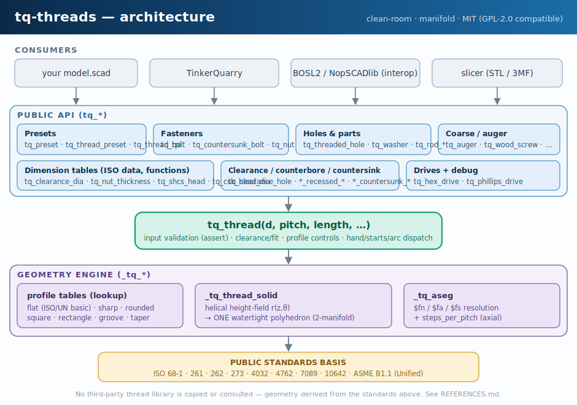

<!-- SPDX-License-Identifier: MIT -->
<div align="center">

# tq‑threads

### Clean‑room, printable **screw threads for OpenSCAD** — ISO metric + Unified, plus the hardware built from them.

[](LICENSE)
[](#license--attribution)
[](https://openscad.org)
[](CHANGELOG.md)
[](https://github.com/scottconverse/tq-threads/actions/workflows/ci.yml)

*Threaded rods, bolts, nuts, tapped holes, countersinks, washers, standoffs, couplers and caps — every thread is a single watertight `polyhedron`, so models stay manifold and export straight to STL.*

</div>

---

## Why tq‑threads

- **Clean‑room & standards‑based.** Written from public engineering standards only (ISO 68‑1, ISO 261/262, ISO 273, ISO 4032, ISO 4762, ISO 7089, ISO 10642, ASME B1.1). No third‑party thread library was copied or consulted — see [REFERENCES.md](REFERENCES.md).
- **Manifold by construction.** The thread surface is a helical *height‑field* turned into one closed `polyhedron` (no boolean unions to go non‑manifold). It renders cleanly and slices.
- **Printable‑first.** Fit clearance, internal‑oversize / external‑undersize compensation, lead‑in chamfers, rounded roots, and `$fn/$fa/$fs` resolution are all parameters.
- **Batteries included.** **101 presets** (M1.6–M64 coarse + full ISO 261 fine + UNC/UNF #0–1″), plus bolts (hex/socket/**Phillips**), nuts, washers, countersunk & wood screws, **augers**, clearance/counterbore/countersink holes, standoffs, couplers, child‑difference wrappers (`tq_tap`/`tq_drill`/…), and a debug view. Profile control: custom flank **angle**, **tooth_height**, **minor_d**, **taper**, and optional **ISO 965 `fit=`** allowance.
- **MIT licensed** → permissive *and* GPL‑2.0‑compatible, so it drops into a GPL‑2.0‑only project (e.g. TinkerQuarry) unchanged.

<div align="center">

</div>

---

## Contents

- [Install / use as a library](#install--use-as-a-library)
- [Quick start](#quick-start)
- [Integrating with other OpenSCAD packages](#integrating-with-other-openscad-packages)
- [Capability checklist](#capability-checklist)
- [Thread terminology](#thread-terminology)
- [Diameter vs pitch vs TPI](#diameter-vs-pitch-vs-tpi)
- [FDM tolerance guide](#fdm-tolerance-guide)
- [When to use heat‑set inserts](#when-to-use-heat-set-inserts)
- [API reference](#api-reference)
- [Presets](#presets)
- [Testing & render‑proof](#testing--render-proof)
- [Limitations](#limitations)
- [Versioning, contributing, license](#license--attribution)

> Looking for the deep dive? The full **[user manual is in MANUAL.md](MANUAL.md)** — every parameter, every helper, integration recipes, and migration notes.

---

## Install / use as a library

OpenSCAD has no central package manager; libraries are consumed by putting the
`.scad` file where an `include`/`use` can find it. Pick whichever fits:

**1. Git submodule (recommended for a project under version control)**
```sh
git submodule add https://github.com/scottconverse/tq-threads libs/tq-threads
```
```openscad
include <libs/tq-threads/tq_threads.scad>;
tq_thread_preset("M8", 20);
```

**2. Clone / download a release, drop on the OpenSCAD library path**
```sh
git clone https://github.com/scottconverse/tq-threads
# copy tq_threads.scad into your OpenSCAD library folder, e.g.:
#   Windows : %USERPROFILE%\Documents\OpenSCAD\libraries\
#   Linux   : ~/.local/share/OpenSCAD/libraries/
#   macOS   : ~/Documents/OpenSCAD/libraries/
```
```openscad
include <tq_threads.scad>;   // resolved from the library path
```

**3. Vendoring (e.g. into TinkerQuarry's `library/` folder)**
Copy `tq_threads.scad` next to your model and `include <tq_threads.scad>;`.
A release `.zip` (Releases tab) works the same way for non‑git users.

> Only `tq_threads.scad` is required at runtime. The `*_examples.scad`,
> `*_tests.scad`, `scripts/`, and `docs/` are for development and can be ignored
> by consumers.

---

## Quick start

```openscad
include <tq_threads.scad>;
$fn = 64;

// 1. An M8 × 1.25 threaded rod, 20 mm long
tq_thread_preset("M8", 20);

// 2. A tapped M6 hole through a block
difference() {
    cube([20, 20, 12], center = true);
    tq_threaded_hole(d = 6, pitch = 1.0, depth = 12);
}

// 3. A socket-head cap screw and a matching nut (same clearance => they fit)
tq_bolt(d = 8, pitch = 1.25, length = 20, head = "socket", shank = 4, clearance = 0.4);
translate([20,0,0]) tq_nut(d = 8, pitch = 1.25, clearance = 0.4);

// 4. Imperial by threads-per-inch
translate([0,20,0]) tq_thread_tpi(d = tq_in(1/4), tpi = 20, length = 12);
```

Open any `.scad` here in OpenSCAD: **F5** previews instantly, **F6** renders.
Headless STL:
```sh
openscad -o rod.stl -D 'SHOW="bolt"' tq_threads_examples.scad
```

---

## Integrating with other OpenSCAD packages

tq‑threads is a plain library with a `tq_`‑prefixed namespace, so it coexists
with anything. Common combinations (full recipes in **[MANUAL.md](MANUAL.md#integration)**):

| You use… | How tq‑threads fits |
|---|---|
| **BOSL2 / BOSL** | Use BOSL2 for attachments, rounding, and shapes; use tq‑threads for the actual threads. No symbol clashes (`tq_*` vs BOSL2's names). Subtract `tq_thread_cutter()` from BOSL2 solids; the `tq_*` parts are normal children you can `attach()` around. |
| **Migrating from Dan Kirshner / rcolyer `threads.scad`** | `metric_thread(d,p,l)` → `tq_thread(d,p,l)`; `english_thread()` → `tq_thread_tpi()`; `ScrewThread`/`ScrewHole` → `tq_thread` / `tq_threaded_hole`; `RodStart/RodEnd` → `tq_rod_start/tq_rod_end`. See the [migration table](MANUAL.md#migration). |
| **TinkerQuarry / KimCad** | MIT → GPL‑2.0 compatible; vendor `tq_threads.scad` into `library/` and `include` it from generated `.scad`. The generator can call presets by name (`tq_thread_preset("M8", …)`). |
| **Slicers (Orca/Cura/Prusa/Bambu)** | Export STL/3MF; threads are manifold so no repair step is needed. Print **axis vertical** for best flanks. |
| **NopSCADlib / hardware libs** | Use their part catalogs for visualization; use tq‑threads when you need a *printable* thread instead of a cosmetic one. |

---

## Capability checklist

| Capability | API |
|---|---|
| ISO metric external thread | `tq_thread(internal=false)` |
| ISO metric internal cutter | `tq_thread_cutter` / `internal=true` |
| Unified external / internal | `tq_thread_tpi`, inch presets |
| Named presets (101: metric coarse+fine + UNC/UNF) | `tq_thread_preset`, `tq_preset`, `tq_preset_count` |
| ISO 965 fit class (allowance) | `fit="6g"`/`"6H"`/… |
| Custom Ø / pitch / TPI / minor Ø | `tq_thread`, `tq_thread_tpi`, `minor_d=` |
| Left / right hand | `hand="left"\|"right"` |
| Multi‑start | `starts=N` |
| Length / centering | `length=`, `center=` |
| Lead‑in/out chamfers | `lead_in`, `lead_out`, `chamfer` |
| FDM clearance + over/undersize | `clearance=`, `internal=` |
| Flat / sharp / rounded profile | `profile=`, `crest_flat`, `root_flat`, `round` |
| **Custom flank angle** | `angle=` (default 60°) |
| **Explicit tooth height** | `tooth_height=` |
| **Tapered threads** (NPT‑ish, auger tips) | `taper=` |
| Partial arc | `arc=<deg>` |
| Rod / bolt / countersunk bolt / wood screw | `tq_threaded_rod`, `tq_bolt`, `tq_countersunk_bolt`, `tq_wood_screw` |
| **Hex *or* Phillips drive** | `drive="hex"\|"phillips"\|"none"`; `tq_phillips_drive`, `tq_phillips_tip` |
| **Auger / deep coarse flight** | `tq_auger`, `tq_auger_hole` |
| Nut / standoff / coupler | `tq_nut`, `tq_standoff`, `tq_rod_coupler` |
| Tapped / clearance / counterbore / countersink holes | `tq_threaded_hole`, `tq_clearance_hole`, `tq_recessed_clearance_hole`, `tq_countersunk_clearance_hole` |
| **Child‑difference wrappers** | `tq_tap`, `tq_drill`, `tq_counterbore`, `tq_countersink` |
| **Thread‑relief groove** | `tq_relief_groove` |
| Washer | `tq_washer` |
| Hex / drive geometry | `tq_hex`, `tq_hex_drive`, `tq_hex_across_flats/corners`, `tq_hex_key_af` |
| Bottle / coarse thread | `tq_bottle_thread` |
| Debug view | `tq_thread_debug` |

---

## Thread terminology

```
        |<-- P -->|              P     = pitch: axial crest-to-crest distance
     /\        /\        /\       crest = outer tip of the thread
    /  \      /  \      /  \      root  = inner valley between threads
___/    \____/    \____/    \__   flank = angled side wall (60° included angle)
   |<-------- major Ø -------->|  major Ø = largest diameter (over crests)
       |<---- minor Ø ---->|      minor Ø = smallest diameter (over roots)
   lead = axial advance per turn = starts × P
```

- **External** = bolt/rod (crests outward). **Internal** = nut/tapped hole (the negative; cut with `tq_thread_cutter`).
- **Hand**: right‑hand advances when turned clockwise (default). Left is mirrored.
- **Starts**: multi‑start = several parallel grooves; `lead = starts × P` (faster travel, common on caps).

---

## Diameter vs pitch vs TPI

| System | You give | Call |
|---|---|---|
| Metric | major Ø + **pitch (mm)** | `tq_thread(d, pitch, length)` |
| Imperial / Unified | major Ø + **TPI** | `tq_thread_tpi(d, tpi, length)` |

`pitch_mm = 25.4 / TPI`. `tq_in(x)` converts inches → mm. Pitch ≠ lead unless single‑start.

---

## FDM tolerance guide

`clearance` is the **total diametral gap** between mating threads, split evenly
(external shrinks `clearance/2`, internal grows `clearance/2`). Make a bolt and
its nut with the **same** `clearance` and they fit.

| Printer / fit | `clearance` |
|---|---|
| Tight, well‑tuned | 0.2 – 0.3 mm |
| **Default / safe** | **0.4 mm** |
| Loose / fast | 0.5 – 0.6 mm |
| Coarse caps / lids | 0.5 – 0.8 mm |

- Print **axis vertical**; avoid supports inside tapped holes.
- Keep lead‑in chamfers on (default) for self‑starting threads + clean top layers.
- Pitches **< ~0.7 mm** (fine M2–M3) are at a 0.4 mm nozzle's limit — print slow or use a heat‑set insert.
- `profile="rounded"` gives stronger roots for load‑bearing parts.
- Calibrate once with a small clearance matrix; it's the highest‑value 10 minutes you'll spend.

---

## When to use heat‑set inserts

`fit=` is nominal ISO 965 position intent, not an FDM fit knob. For example,
M8 `6g` shifts diameter by about 0.029 mm, below typical printed clearance and
layer-line effects; tune `clearance` for real printed fit.

Reach for **brass heat‑set inserts** instead of a printed thread when the hole is small/fine (≤ M3), the joint is assembled/disassembled often, you need high pull‑out/torque, or you're threading across layer lines (side walls). For those, print a smooth tapered pilot (a plain `cylinder()` or `tq_standoff` with a plain bore) sized to the insert spec and melt it in. Reserve `tq_threaded_hole` for printed threads ≥ M4 and coarse/cap threads. Details in [MANUAL.md](MANUAL.md#heat-set-inserts).

---

## API reference

Concise list; **full signatures + every parameter are in [MANUAL.md](MANUAL.md#api)**.

```openscad
// core (v0.4 adds fit, minor_d; v0.3 added angle, tooth_height, taper)
tq_thread(d, pitch, length, internal=false, starts=1, hand="right",
          clearance=0.4, fit=undef, profile="flat", angle=60, tooth_height, minor_d,
          crest_flat, root_flat, round=1, lead_in=true, lead_out=true, chamfer, taper=0,
          arc=360, fn, steps_per_pitch=16, center=false);
// preset introspection / table self-check
tq_preset_count();  tq_presets_selfcheck();

// presets / specs
tq_preset(name) -> [major, pitch];   tq_thread_preset(name, length, ...);
tq_thread_tpi(d, tpi, length, ...);  tq_in(inches) -> mm;

// threaded primitives
tq_threaded_rod(d,pitch,length,...);  tq_thread_cutter(d,pitch,length,through=true,...);
tq_threaded_hole(d,pitch,depth,through=true,...);  tq_standoff(d,pitch,length,od,...);
tq_nut(d,pitch,height,across_flats,chamfer=true,...);

// bolts / screws (solid, fused) — drive = "hex" | "phillips" | "none"
tq_bolt(d,pitch,length,head="socket"|"hex"|"plain"|"none",shank=0,drive="hex",...);
tq_countersunk_bolt(d,pitch,length,head_d,head_angle=90,shank=0,drive="hex",...);
tq_wood_screw(d,length,pitch,head="countersunk"|"pan",point=true,...);

// drives, auger, relief (v0.3)
tq_phillips_drive(size,depth);  tq_phillips_tip(size,shank_d,length);
tq_ph_dims(size) -> [arm_reach,wing_width];  tq_ph_size_for(d) -> PH number;
tq_auger(d,length,pitch,flight,taper=0,...);  tq_auger_hole(d,length,pitch,flight,through=true,...);
tq_relief_groove(d,width,depth);

// child-difference convenience wrappers (v0.3): cut a hole into children() at `at`
tq_tap(d,pitch,depth,at=[0,0,0],...) <children>;
tq_drill(size,depth,at=[0,0,0],fit="medium",...) <children>;
tq_counterbore(size,depth,at=[0,0,0],...) <children>;
tq_countersink(size,depth,at=[0,0,0],angle=90,...) <children>;

// holes / washers / rods
tq_clearance_hole(size,depth,fit="medium",through=true,...);
tq_recessed_clearance_hole(size,depth,head_d,head_h,...);     // counterbore
tq_countersunk_clearance_hole(size,depth,head_d,angle=90,...);
tq_washer(size,od,id,thk,...);
tq_rod_start(d,pitch,length,...);  tq_rod_end(...);  tq_rod_coupler(d,pitch,length,od,...);
tq_bottle_thread(d,pitch,length,internal=false,depth_frac=0.6,...);

// hardware dimension tables (functions)
tq_clearance_dia(size,fit);  tq_washer_dims(size);  tq_nut_thickness(size);
tq_nut_across_flats(size);   tq_shcs_head(size);    tq_hex_key_af(size);  tq_csk_head_dia(size);

// hex / drive
tq_hex(af,h);  tq_hex_drive(af,depth);  tq_hex_across_flats(ac);  tq_hex_across_corners(af);

// debug
tq_thread_debug(d,pitch,length,...);
```

---

## Standards & fidelity (exact vs. approximate)

tq-threads is **printable-first, not metrology-grade** — it renders one nominal
surface, so it cannot certify a tolerance class or replace gauges/calipers. Every
table/formula is classified **EXACT / DERIVED / FDM / APPROX** in
[REFERENCES.md §0](REFERENCES.md) and the [PROVENANCE ledger](PROVENANCE.md):

- **Exact nominal**: metric coarse/fine Ø+pitch (ISO 261), Unified Ø+TPI (ASME B1.1), listed ISO hardware dims (273/4032/4762/7089/10642).
- **Derived** (exact formula): the 60° form & `H`, custom-`angle` geometry, rounded fillets, and the optional **ISO 965 `fit=`** allowance (the *position*, e.g. `es=-(15+11·P)` µm for `g`; the tolerance *grade/band* is **not** modelled). On M8 `6g`, this is about 0.029 mm diametral shift, so treat it as nominal intent and use `clearance` for FDM fit.
- **FDM defaults**: `clearance` (0.4 mm) and resolution floors.
- **Approx / generic** (no standard claimed): Phillips recess, `tq_auger`, `tq_bottle_thread`, `tq_wood_screw`, ratio fallbacks for unlisted sizes.

```openscad
tq_thread(8,1.25,20);                          // printable default (FDM clearance)
tq_thread(8,1.25,20, clearance=0);             // nominal geometry, no allowance
tq_thread(8,1.25,20, clearance=0, fit="6g");   // + ISO 965 position-g allowance
```
What needs **physical prints + calipers** (real fit, class compliance, SPI/GPI
interchange, pull-out strength) is listed in [PROVENANCE.md](PROVENANCE.md).

---

## Presets (101)

Metric coarse (ISO 261): `M1.6 M2 M2.5 M3 M3.5 M4 M5 M6 M7 M8 M10 M12 M14 M16 M18 M20 M22 M24 M27 M30 M33 M36 M39 M42 M45 M48 M52 M56 M60 M64`
Metric fine (ISO 261): `M3x0.35 M4x0.5 M5x0.5 M6x0.75 M8x1 M8x0.75 M10x1.25 M10x1 M10x0.75 M12x1.5 M12x1.25 M12x1 M14x1.5 M16x1.5 M16x1 M18x2 M18x1.5 M20x2 M20x1.5 M20x1 M22x1.5 M24x2 M24x1.5 M27x2 M30x3 M30x2 M30x1.5 M33x2 M36x3 M36x2 M42x3 M48x3`
Unified numbered (ASME B1.1): `#0-80 #1-64 #1-72 #2-56 #2-64 #3-48 #3-56 #4-40 #4-48 #5-40 #5-44 #6-32 #6-40 #8-32 #8-36 #10-24 #10-32 #12-24 #12-28`
Unified fractional: `1/4-20 1/4-28 5/16-18 5/16-24 3/8-16 3/8-24 7/16-14 7/16-20 1/2-13 1/2-20 9/16-12 9/16-18 5/8-11 5/8-18 3/4-10 3/4-16 7/8-9 7/8-14 1-8 1-12`

```openscad
p = tq_preset("M12");          // -> [12, 1.75]
tq_thread_preset("#10-32", 16);
echo(tq_preset_count());        // 101   (assert tq_presets_selfcheck())
```

---

## Testing & render‑proof

```sh
# fast smoke suite (preset assertions + small grid) — seconds
openscad -o selftest.stl tq_threads_selftest.scad   # standards-table asserts
openscad -o out.stl      tq_threads_fast_tests.scad

# full visual demo grid — minutes (N-way union); F5 preview is instant
openscad -o demo.stl tq_threads_heavy_tests.scad
```
PowerShell render‑proof (auto‑detects OpenSCAD, checks for manifold warnings):
```powershell
powershell -ExecutionPolicy Bypass -File scripts\render_proof.ps1          # full proof: PASS/FAIL, version+timings, negative tests, exits nonzero on fail
powershell -ExecutionPolicy Bypass -File scripts\render_proof.ps1 -Heavy   # + heavy grid
```
Runs on Windows PowerShell 5.1 and pwsh 7+. (`scripts/render-tests.ps1` is a deprecated alias.) On Windows it prefers `openscad.com` (returns console exit codes/output).

**Running one example (Windows-robust, no fragile quoting):**
```sh
openscad -o bolt.stl examples/bolt.scad                  # wrapper file — works in every shell
openscad -o nut.stl  -D PART=5 tq_threads_examples.scad  # shell-safe numeric index (no quotes)
```
> The legacy `-D SHOW="bolt"` form still works but needs careful PowerShell quoting (`-D 'SHOW=\"bolt\"'`); it's a fallback, not the primary path.

A GitHub Actions workflow ([`.github/workflows/ci.yml`](.github/workflows/ci.yml)) runs the suites on every push.

---

## Limitations

- Default `flat` profile uses the ISO/UN **basic** truncations (flat root, engaged height `0.5413·P`); choose `profile="rounded"` for the deeper rounded root.
- Internal threads are cut with an external‑form **cutter** sized by `clearance` — pragmatic and accurate for FDM, not metrology‑grade.
- It's a **height‑field**, so high `$fn` × long coarse threads make large meshes; tune `$fn`/`steps_per_pitch` for big parts.
- A single fused STL of the *whole* heavy grid is slow (N‑way CGAL union) — that's the union, not any one part. Per‑part export and F5 preview are fast.
- `profile="sharp"` makes knife‑edge crests (for self‑tapping screws / visualization), not for load.
- Tapered pipe (NPT), ACME/trapezoidal, and buttress forms are out of scope of this 60°‑V library.

---

## Migration from v0.2 / v0.3

v0.5 is **backward compatible** — no public API was removed or renamed.

- `include <tq_threads.scad>;` unchanged; default `angle=60` keeps v0.2/v0.3 geometry bit-for-bit.
- New **optional** params: `tq_thread(... fit=, minor_d=)`; `tq_wood_screw(... taper=, core_d=, thread_depth=, point="gimlet"|"cone"|"flat", shank=)` (old `point=true/false` still works); `tq_bottle_thread(... angle=, tooth_height=, profile=, lead_in=)`.
- Presets expanded 43 → **101** (existing names unchanged).
- Example selection: prefer **`examples/<part>.scad` wrappers** or **`-D PART=n`** over the old `-D SHOW="..."` string (still supported).
- `scripts/render-tests.ps1` → **`scripts/render_proof.ps1`** (old name kept as a deprecated alias).

---

## License & attribution

MIT — see [LICENSE](LICENSE). The FSF lists MIT/Expat as **GPL‑compatible**, so
tq‑threads can be included in and distributed with a GPL‑2.0‑only project.
Geometry derives from public standards only; the clean‑room statement and the
full list of standards/formulae are in [REFERENCES.md](REFERENCES.md).
Contributions welcome — see [CONTRIBUTING.md](CONTRIBUTING.md) and the
[discussion seeds](docs/discussions/).
